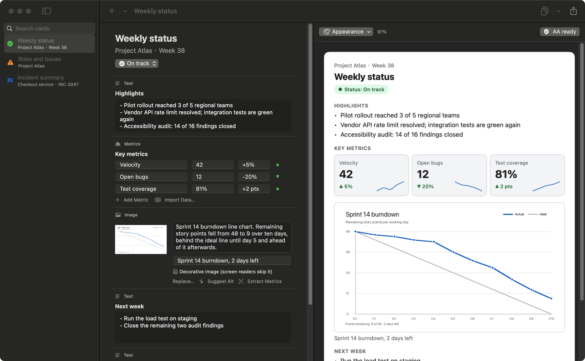
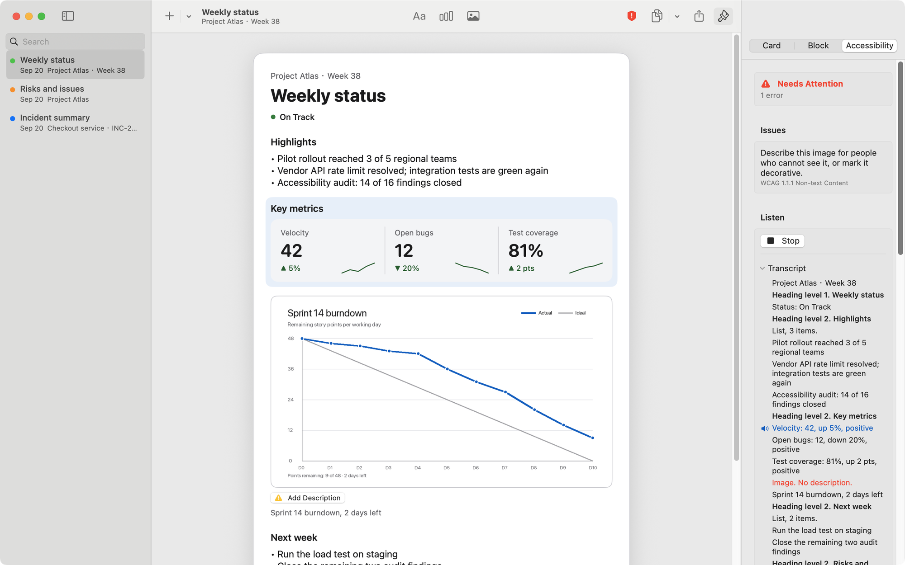
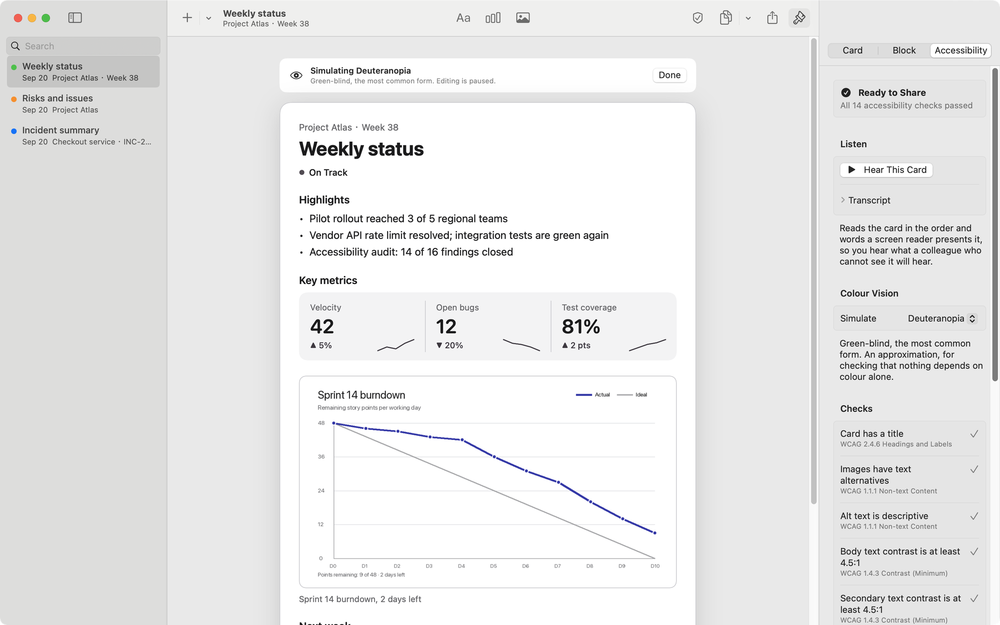
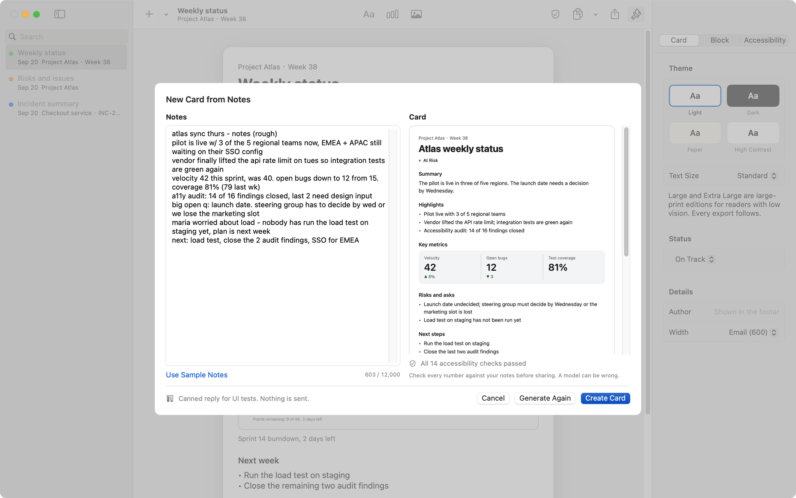
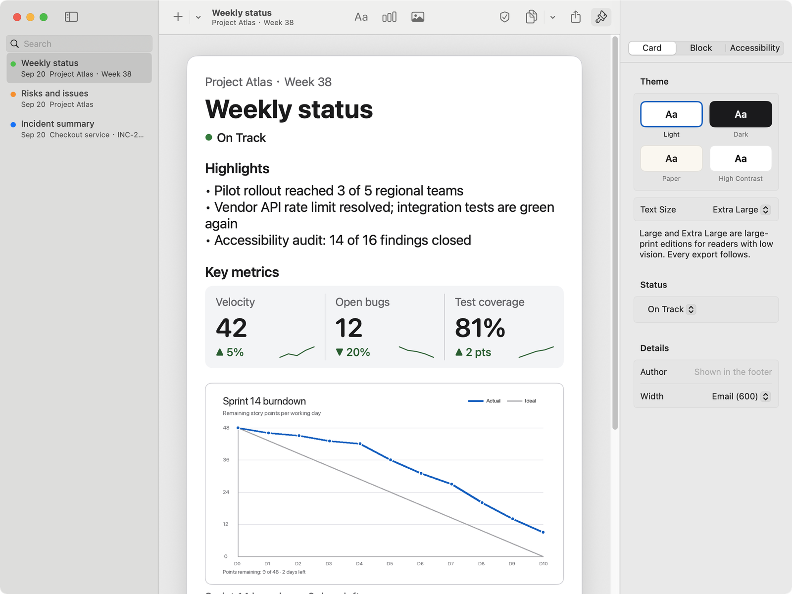
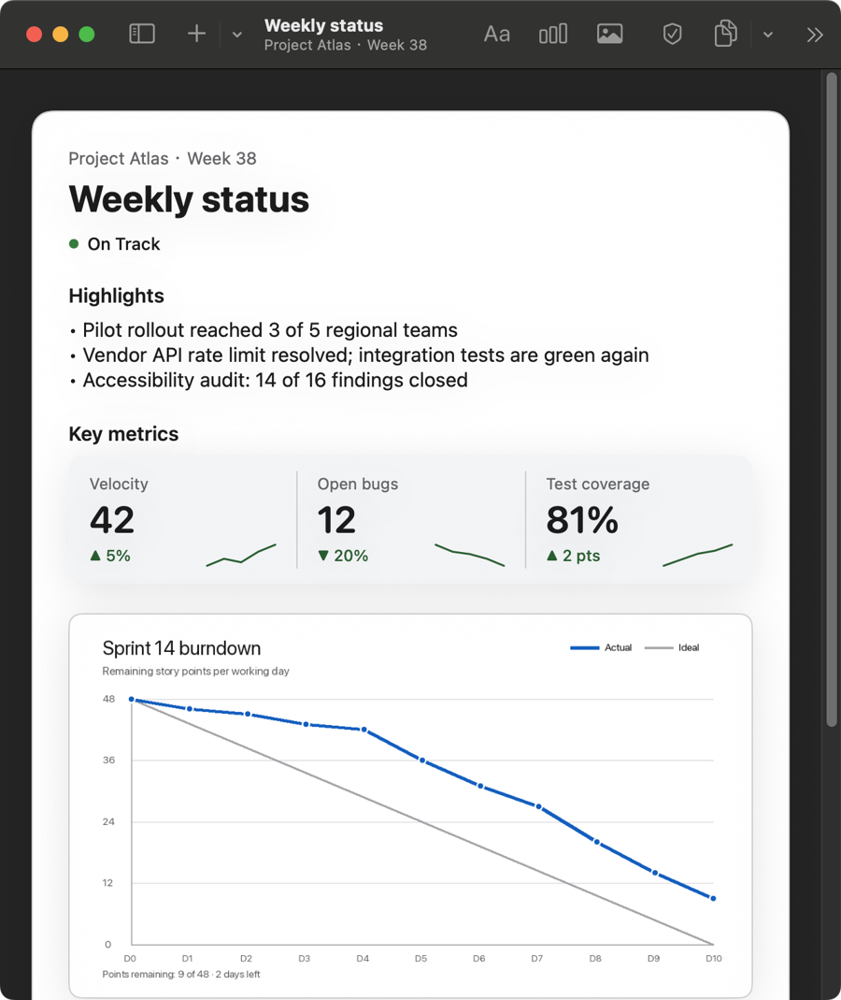

# Reporting Builder

A native macOS tool that turns raw text, metric data and images into polished,
accessible **Snippet Cards** ready to paste into Mail, Slack, Notes or any
other tool your team uses.

<picture>
  <source media="(prefers-color-scheme: dark)" srcset="docs/assets/app-window-dark.png">
  
</picture>

> Proof of concept for the brief "Project Reporting Builder". Five-day scope,
> documented trade-offs, no backend.

**See it without building it:** the [card gallery](https://anti-tony.github.io/apple_oa/)
is every built-in template in every theme, rendered by the same HTML renderer the app
uses for "Copy for Email" and published by CI only when all of them pass the
accessibility linter in strict mode.

## What it does

| Need from the brief | How Reporting Builder answers it |
|---|---|
| Ingest raw text, metric data and images | Type or paste text; paste CSV, spreadsheet cells, JSON or `Label: value` lines and get metrics with change arrows; drop or paste images. **Paste as Block** (⇧⌘V) picks the block type for you. On-device Vision can read numbers out of a dashboard screenshot. |
| Modular cards | Cards are ordered blocks: text, metrics (grouped tiles or a table, with sparklines) and images. Reorder from the keyboard (⌥⌘↑/↓), the context menu or the inspector. Six templates to start from. |
| Visually polished | Built like a Pages or Keynote document window: a list, the card itself as the editing canvas, and a Format inspector. The card is typographic: one large title, sentence-case headings, SF Rounded numerals, a single quiet group for metrics. Four themes; PNG export at 1×–3×. |
| Accessibility-compliant | A built-in **accessibility linter** checks fourteen WCAG-mapped rules as you type, from contrast and alt text to "the red items" and images that are mostly text. **Hear This Card** reads the card the way a screen reader presents it; **Colour Vision** shows it as people with colour-vision deficiencies see it. Cards can be set in **large print**, and export as a **tagged PDF**. The toolbar shows the verdict; the inspector's Accessibility tab (⇧⌘K) lists issues and jumps to the block at fault. Exported HTML is semantic; status is never colour-only; images require alt text. The app itself is built for VoiceOver and the keyboard, and its UI tests include XCTest's accessibility audit. |
| Instantly copy or export | **Copy for Email** (⇧⌘C) puts rich text with images, HTML and plain text on the clipboard at once. Also copy as image, Markdown, Slack format, plain text or HTML source. **File ▸ Export** writes a **tagged PDF**, PNG, HTML, Markdown, plain text or JSON. Share sheet (Mail, Messages, AirDrop, Notes). Drag the preview straight into another app. |
| Responsive | The window reflows from list + canvas + inspector, to canvas + inspector, to the canvas alone (minimum 480 pt), and the card on the canvas is fluid. Exported HTML is a responsive page. |
| Deploy on cloud | GitHub Actions publishes the app to **Releases** and a **card gallery to GitHub Pages**, rendered headless by the `reportcard` command-line tool from the same renderers. The Pages build fails if any template stops passing the accessibility linter. |
| Usable without the README | A real **Help** menu (⌘?) opens a guide in its own window: every keyboard shortcut the app binds, what the accessibility shield means, and where your cards live. The shortcut list is rendered from the same catalogue the menu bar binds, so it cannot name a key the app does not (ADR 0013). |
| Surprise and delight | **New Card from Notes** turns rough meeting notes into a structured, linted card with a language model (opt-in, on-device where available; see the note below). Audio Graphs for metric trends, a VoiceOver Blocks rotor and block actions, Undo/Redo, Continuity Camera import, printing, a Shortcuts action, alt-text suggestions, JSON import/export, and `reportcard lint` as an accessibility gate for CI pipelines. |

| Hear This Card | Colour Vision |
|---|---|
|  |  |
| **New Card from Notes** (here with the canned model the UI tests use) | **Large print**, and the same app in a 640 pt window in Dark Mode |
|  |   |

> **About the language-model features.** They are off by default and provider-agnostic: Apple's on-device
> model where available, otherwise an OpenAI-compatible endpoint you configure. For this proof of concept the
> endpoint defaults to a public API so the feature can be demonstrated on a Mac without Apple Intelligence.
> **Sending real project data to a public third-party model is not acceptable in a real business setting**;
> production would use the on-device model or an approved internal gateway. The reasoning and the guard rails
> are in [ADR 0011](docs/adr/0011-opt-in-writing-assistance.md).

## Quick start

Requirements: macOS 14 Sonoma or later. Xcode 16 or later to build (developed
on Xcode 26.3 / Swift 6.2). No accounts, and no network unless you switch on
writing assistance.

```sh
git clone <this repo>
cd project-reporting-builder
make open          # opens ReportingBuilder.xcodeproj; press ⌘R
```

Or from the terminal:

```sh
make build && make run
make test          # core package tests + app unit tests
make test-ui       # UI tests incl. accessibility audit (launches the app)
```

The project is ad-hoc signed so it builds on any Mac without a team. The
sample cards appear on first launch; delete them with ⌫.

The same renderers run without a window:

```sh
make site          # static card gallery in ./_site (what CI publishes to Pages)
cd Packages/ReportCore
swift run reportcard render --template weekly_status --format slack
swift run reportcard lint --input card.json --strict    # exit 1 if not accessible
```

## Five-minute tour

1. **New card** with the `+` button (⌘N), or hold it for a template.
2. **Type on the card.** Click the title, the status, a heading, a number. A
   line that starts with `- ` becomes a bullet. A metric's change can be typed
   as `+5%` or `-3`; whether that is good news is inferred from the label
   ("Open bugs ▼" is good) and can be overridden from the context menu or the
   inspector.
3. **Add content** from the toolbar (Text, Metrics, Image), by pasting with
   ⇧⌘V, which picks the right block for a table, an image or prose, or by
   dropping files onto the window.
4. **Format** with the paintbrush: theme, status, author and width for the
   card; layout and data import for metrics; description for images.
5. **Check** the shield in the toolbar. If it turns red, the Accessibility tab
   says what to fix and takes you there.
6. **Hear This Card** (⌥⌘L) in the Accessibility tab, and try **Colour Vision**.
7. **Copy for Email** (⇧⌘C) and paste into Mail. Hold the Copy button for the
   other clipboard formats, or use the share button.
8. **File ▸ Export** for a file: a **tagged PDF** with a real structure tree,
   PNG at 1×–3×, HTML, Markdown, plain text or JSON. **⌘P** prints the same
   layout.

To try **New Card from Notes** (⇧⌘N): Settings → Writing Assistance → turn it on,
choose the model, and for a custom endpoint paste an API key (kept in the
Keychain). The sheet has sample notes.

## Architecture in one paragraph

`SnippetCard` is a plain value type in the `ReportCore` Swift package (no UI
frameworks). Every output is a pure function of it: the SwiftUI `CardView`
(PNG export; the editable canvas is built from the same pieces), `HTMLRenderer`
(email fragment or standalone page),
`AttributedCardRenderer` (RTF/RTFD for Mail and Notes), `MarkdownRenderer`
(CommonMark and Slack) and `PlainTextRenderer`. The same model feeds the
accessibility linter, templates, persistence and import/export. The macOS app
layer adds the canvas and inspector, pasteboard and share integration, drag
and drop, Vision assist and Shortcuts. Details in [docs/ARCHITECTURE.md](docs/ARCHITECTURE.md).

```
┌──────────────────────────── App (SwiftUI, AppKit) ────────────────────────────┐
│  Card list  │  Canvas: the card, edited in place  │  Format inspector           │
│  CardStore (persistence)  ·  WorkspaceState  ·  PasteboardWriter  ·  Exporter  │
└────────────────────────────────────┬──────────────────────────────────────────┘
                                     │ SnippetCard (value type)
┌────────────────────────────────────┴──────────────────────────────────────────┐
│  ReportCore (SwiftPM, macOS + iOS)                                             │
│  Model · MetricsParser · ContentDetector · AccessibilityLinter · Templates     │
│  HTMLRenderer · MarkdownRenderer · PlainTextRenderer · CardCodec              │
└───────────────────────────────────────────────────────────────────────────────┘
```

## Engineering practice

- **Tests**: 90 Swift Testing cases for the package (parsers, renderers,
  contrast maths, the fourteen linter rules, spoken narration, large print, the
  draft parser and prompts, templates, and the command-line tool), 47 for
  the app layer (store and undo, persistence, export including tagged PDF,
  pasteboard, ingestion, the assistant with a stubbed network, colour-vision
  maths, configuration, window layout), and 14 XCUITest end-to-end flows: the
  canvas, the inspector, the undescribed-image prompt, Hear This Card (muted),
  Colour Vision, New Card from Notes with a canned model, the help window, and
  `performAccessibilityAudit()`. Run `make test`; run the UI tests from Xcode
  (⌘U), because macOS asks the person at the keyboard to allow UI automation.
- **CI**: GitHub Actions runs package tests and a command-line smoke test,
  builds the app from a freshly generated project and runs its unit tests, and
  checks SwiftLint and SwiftFormat. See `.github/workflows/ci.yml`.
- **Configuration**: `project.yml` (XcodeGen) and `Config/*.xcconfig` hold
  every build setting, version and feature flag. Flags reach runtime through
  `AppConfiguration`; user settings live in `UserPreferences`.
- **Conventions**: Swift 6 language mode, strict concurrency, SwiftLint and
  SwiftFormat configs committed, Conventional Commits, `///` docs on public API.
- **Documentation**: this README, [ARCHITECTURE](docs/ARCHITECTURE.md),
  [ACCESSIBILITY](docs/ACCESSIBILITY.md), [EXPORT_COMPATIBILITY](docs/EXPORT_COMPATIBILITY.md),
  [DEPLOYMENT](docs/DEPLOYMENT.md), [ADRs](docs/adr/), [CONTRIBUTING](CONTRIBUTING.md),
  [CHANGELOG](CHANGELOG.md).

## Cloud and deployment

User data is deliberately local-first: cards live in a JSON file inside the
app sandbox and nothing leaves the Mac unless you turn on writing assistance
with a custom endpoint and press one of its buttons (ADR 0011). What is deployed is the software and
its output. GitHub Actions renders the template gallery to GitHub Pages with the
`reportcard` command-line tool, gated on the accessibility linter, and a version
tag builds the app and publishes it to GitHub Releases (the workflow is in place;
no release has been cut yet). [docs/DEPLOYMENT.md](docs/DEPLOYMENT.md)
covers the pipeline, enterprise distribution (notarisation, Apple Business
Manager, MDM) and the next step, a share-link service (CloudKit, or a small
Swift service in a container).

## Known limitations

- Paste behaviour depends on the receiving app. The tested matrix is in
  [docs/EXPORT_COMPATIBILITY.md](docs/EXPORT_COMPATIBILITY.md); untested
  destinations are marked as such.
- Rich text (RTF) has no alt-text concept, so images pasted into Mail carry
  the caption but not the alt text. HTML and Markdown exports keep it.
- The text markup is intentionally tiny (paragraphs and bullets). Bold,
  links and tables inside text blocks are out of scope.
- Vision's classifier gives rough alt-text suggestions; the user must edit them.
- The on-device language model path (macOS 26 or later) compiles and is guarded by
  availability checks, but was not run on hardware: the development Mac is on
  macOS 15. The custom-endpoint path is tested against a stubbed network; a live
  call needs your own key.
- Hear This Card, the Audio Graph, the Blocks rotor and block actions are covered
  by unit tests for their data, and need a person with VoiceOver for the experience.
- The tagged PDF is checked for real text, metadata and a structure tree, not
  validated against PDF/UA.
- Undo covers structural edits and card deletion; typing is undone by the text
  field it happens in.
- English only. A String Catalog is in place and kept in sync by the build,
  so translating is a matter of filling it in; user-facing strings built in
  code (notices, accessibility labels) would need `String(localized:)` first.
- The UI tests, including the accessibility audit, run from Xcode only. They were
  written against the accessibility identifiers in the code; run them with ⌘U.

## Project layout

```
project.yml                 XcodeGen spec (source of truth for the .xcodeproj)
Config/                     Shared/Debug/Release xcconfig, feature flags
Packages/ReportCore/        Platform-neutral domain package, reportcard CLI, tests
App/                        macOS app: Store, Views, Export, Ingestion, Intents, Config
Tests/AppTests/             App unit tests (Swift Testing)
Tests/AppUITests/           XCUITest flows + accessibility audit
docs/                       Architecture, accessibility, export matrix, deployment, ADRs
.github/workflows/          ci.yml (tests, lint), release.yml (app → Releases), pages.yml (gallery → Pages)
Makefile                    generate / build / run / test / lint / format
```

## License

MIT © 2026 Tony Wen
