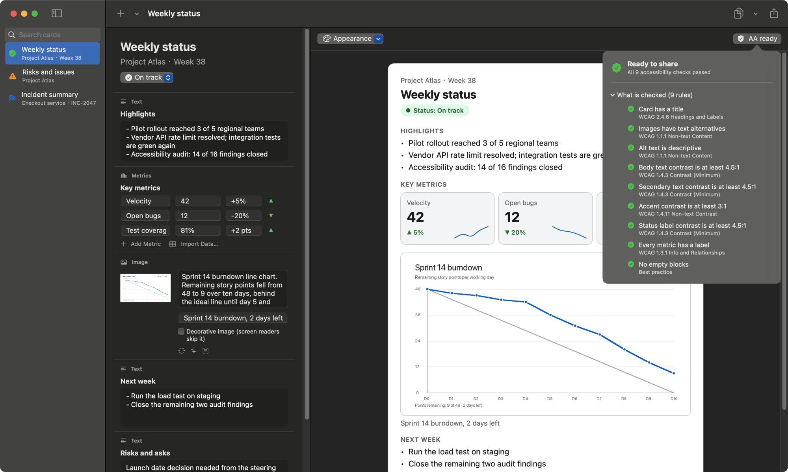

# Reporting Builder

A native macOS tool that turns raw text, metric data and images into polished,
accessible **Snippet Cards** ready to paste into Mail, Slack, Notes or any
other tool your team uses.


> Proof of concept for the brief "Project Reporting Builder". Five-day scope,
> documented trade-offs, no backend.

## What it does

| Need from the brief | How Reporting Builder answers it |
|---|---|
| Ingest raw text, metric data and images | Type or paste text; paste CSV, spreadsheet cells, JSON or `Label: value` lines and get metrics with change arrows; drop or paste images. **Smart Paste** (⇧⌘V) picks the block type for you. On-device Vision can read numbers out of a dashboard screenshot. |
| Modular cards | Cards are ordered blocks: text, metrics (tiles or table, with sparklines) and images. Reorder from the keyboard (⌥⌘↑/↓), the context menu or hover controls. Six templates to start from. |
| Visually polished | A deliberately quiet interface: three columns, borderless blocks, controls that appear on hover or focus. Live preview scaled to fit, at email, chat or wide widths; four themes; PNG export at 1×–3×. |
| Accessibility-compliant | A built-in **accessibility linter** checks nine WCAG-mapped rules as you type. A badge above the preview shows the verdict; click it (or ⌥⌘I) for a report that jumps to the offending block. Exported HTML is semantic; status is never colour-only; images require alt text. The app itself is VoiceOver- and keyboard-operable and passes the XCTest accessibility audit. |
| Instantly copy or export | **Copy for Email** (⇧⌘C) puts rich text with images, HTML and plain text on the clipboard at once. Also copy as image, Markdown, Slack format, plain text or HTML source. Export PNG, HTML, Markdown, plain text or JSON. Share sheet (Mail, Messages, AirDrop, Notes). Drag the preview straight into another app. |
| Responsive | The window reflows from three columns to editor + preview to a single pane with an Edit/Preview switch (minimum 560 pt), and the preview scales the card instead of clipping it. Exported HTML is a responsive page. |
| Deploy on cloud | GitHub Actions publishes the app to **Releases** and a **card gallery to GitHub Pages**, rendered headless by the `reportcard` command-line tool from the same renderers. The Pages build fails if any template stops passing the accessibility linter. |
| Surprise and delight | Shortcuts action "Create Card from Clipboard"; alt-text suggestions; live WCAG contrast checking of every theme; JSON import/export; `reportcard lint` as an accessibility gate for CI pipelines. |

| Accessibility report behind the badge | The same app in a 600 pt window |
|---|---|
|  |  |

## Quick start

Requirements: macOS 14 Sonoma or later. Xcode 16 or later to build (developed
on Xcode 26.3 / Swift 6.2). No accounts, no network.

```sh
git clone <this repo>
cd project-reporting-builder
make open          # opens ReportingBuilder.xcodeproj; press ⌘R
```

Or from the terminal:

```sh
make build && make run
make test          # core package tests + app unit tests
make test-ui       # UI tests incl. accessibility audit (launches the app)
```

The project is ad-hoc signed so it builds on any Mac without a team. The
sample cards appear on first launch; delete them with ⌫.

The same renderers run without a window:

```sh
make site          # static card gallery in ./_site (what CI publishes to Pages)
cd Packages/ReportCore
swift run reportcard render --template weekly_status --format slack
swift run reportcard lint --input card.json --strict    # exit 1 if not accessible
```

## Five-minute tour

1. **Pick a template** with the `+` button (or ⌘N for the default).
2. **Edit** title, subtitle and status at the top of the editor. Theme and
   preview width live in the *Appearance* menu above the preview.
3. **Add content**: *Add Block* → Text, Metrics or Image; *Smart Paste* (⇧⌘V);
   or just drop files onto the editor. A metric is one line: label, value and
   a change such as `+5%`. Whether the change is good news is inferred from
   the label ("Open bugs ▼" is good) and flips with a click on the arrow.
4. **Watch the badge** above the preview. Red means an error (say, an image
   without alt text). Click it to see the report and jump to the problem.
5. **Copy for Email** (⇧⌘C) and paste into Mail. Or hold the Copy button for
   other formats, use Export, or the share sheet.

## Architecture in one paragraph

`SnippetCard` is a plain value type in the `ReportCore` Swift package (no UI
frameworks). Every output is a pure function of it: the SwiftUI `CardView`
(preview and PNG), `HTMLRenderer` (email fragment or standalone page),
`AttributedCardRenderer` (RTF/RTFD for Mail and Notes), `MarkdownRenderer`
(CommonMark and Slack) and `PlainTextRenderer`. The same model feeds the
accessibility linter, templates, persistence and import/export. The macOS app
layer adds the editor, pasteboard and share integration, drag and drop,
Vision assist and Shortcuts. Details in [docs/ARCHITECTURE.md](docs/ARCHITECTURE.md).

```
┌──────────────────────────── App (SwiftUI, AppKit) ────────────────────────────┐
│  Sidebar  │  Editor (blocks, Smart Paste, drop)  │  Preview + accessibility badge │
│  CardStore (persistence)  ·  WorkspaceState  ·  PasteboardWriter  ·  Exporter  │
└────────────────────────────────────┬──────────────────────────────────────────┘
                                     │ SnippetCard (value type)
┌────────────────────────────────────┴──────────────────────────────────────────┐
│  ReportCore (SwiftPM, macOS + iOS)                                             │
│  Model · MetricsParser · ContentDetector · AccessibilityLinter · Templates     │
│  HTMLRenderer · MarkdownRenderer · PlainTextRenderer · CardCodec              │
└───────────────────────────────────────────────────────────────────────────────┘
```

## Engineering practice

- **Tests**: 65 Swift Testing cases for the package (parsers, renderers,
  contrast maths, linter, templates, and the command-line tool including site
  generation), 25 for the app layer (store, persistence, export, pasteboard,
  ingestion, configuration, window layout), and 7 XCUITest end-to-end flows
  including `performAccessibilityAudit()` and the compact layout. Run
  `make test` and `make test-ui`.
- **CI**: GitHub Actions runs package tests and a command-line smoke test,
  builds the app from a freshly generated project and runs its unit tests, and
  checks SwiftLint and SwiftFormat. See `.github/workflows/ci.yml`.
- **Configuration**: `project.yml` (XcodeGen) and `Config/*.xcconfig` hold
  every build setting, version and feature flag. Flags reach runtime through
  `AppConfiguration`; user settings live in `UserPreferences`.
- **Conventions**: Swift 6 language mode, strict concurrency, SwiftLint and
  SwiftFormat configs committed, Conventional Commits, `///` docs on public API.
- **Documentation**: this README, [ARCHITECTURE](docs/ARCHITECTURE.md),
  [ACCESSIBILITY](docs/ACCESSIBILITY.md), [EXPORT_COMPATIBILITY](docs/EXPORT_COMPATIBILITY.md),
  [DEPLOYMENT](docs/DEPLOYMENT.md), [ADRs](docs/adr/), [CONTRIBUTING](CONTRIBUTING.md),
  [CHANGELOG](CHANGELOG.md).

## Cloud and deployment

User data is deliberately local-first: cards live in a JSON file inside the
app sandbox and nothing leaves the Mac. What is deployed is the software and
its output. GitHub Actions builds and publishes the app to GitHub Releases,
and renders the template gallery to GitHub Pages with the `reportcard`
command-line tool, gated on the accessibility linter. [docs/DEPLOYMENT.md](docs/DEPLOYMENT.md)
covers the pipeline, enterprise distribution (notarisation, Apple Business
Manager, MDM) and the next step, a share-link service (CloudKit, or a small
Swift service in a container).

## Known limitations

- Paste behaviour depends on the receiving app. The tested matrix is in
  [docs/EXPORT_COMPATIBILITY.md](docs/EXPORT_COMPATIBILITY.md); untested
  destinations are marked as such.
- Rich text (RTF) has no alt-text concept, so images pasted into Mail carry
  the caption but not the alt text. HTML and Markdown exports keep it.
- The text markup is intentionally tiny (paragraphs and bullets). Bold,
  links and tables inside text blocks are out of scope.
- Vision's classifier gives rough alt-text suggestions; the user must edit them.
- No undo yet for block edits (text fields have their own undo).
- English only. A String Catalog is in place and kept in sync by the build,
  so translating is a matter of filling it in; user-facing strings built in
  code (notices, accessibility labels) would need `String(localized:)` first.
- The author shown in a card's footer comes from Settings when the card is
  created; there is no per-card author field in the editor.

## Project layout

```
project.yml                 XcodeGen spec (source of truth for the .xcodeproj)
Config/                     Shared/Debug/Release xcconfig, feature flags
Packages/ReportCore/        Platform-neutral domain package, reportcard CLI, tests
App/                        macOS app: Store, Views, Export, Ingestion, Intents, Config
Tests/AppTests/             App unit tests (Swift Testing)
Tests/AppUITests/           XCUITest flows + accessibility audit
docs/                       Architecture, accessibility, export matrix, deployment, ADRs
.github/workflows/          ci.yml (tests, lint), release.yml (app → Releases), pages.yml (gallery → Pages)
Makefile                    generate / build / run / test / lint / format
```

## License

MIT © 2026 Tony Wen
